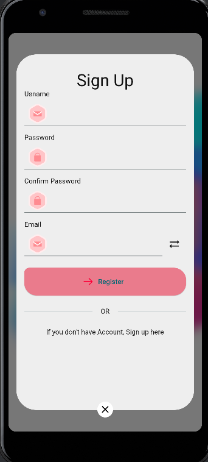
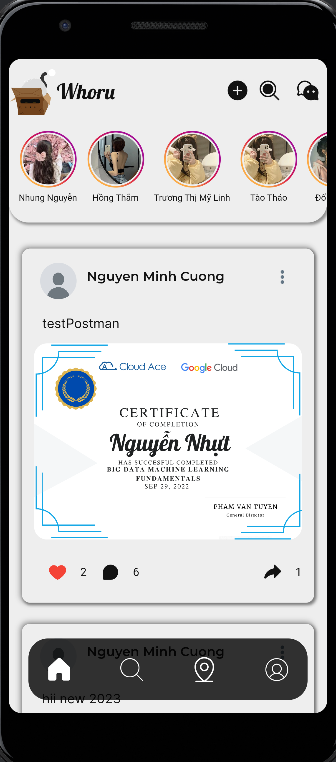
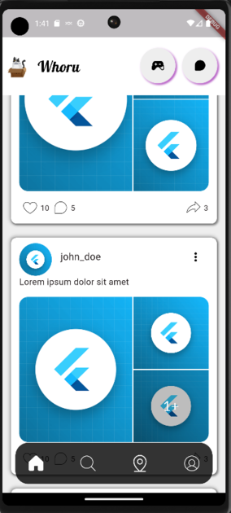
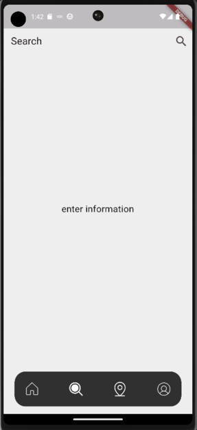
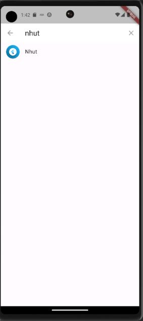
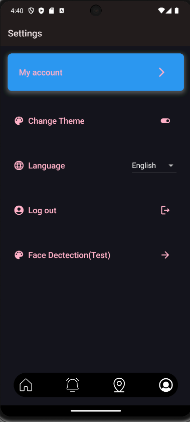
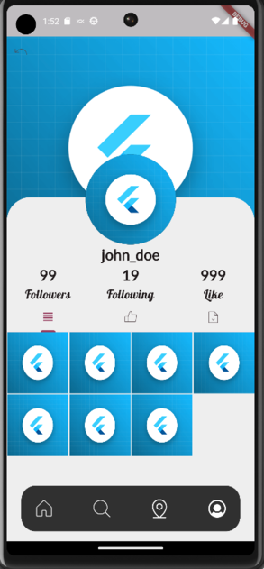
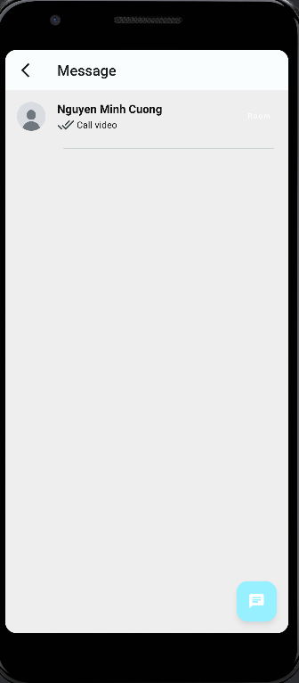
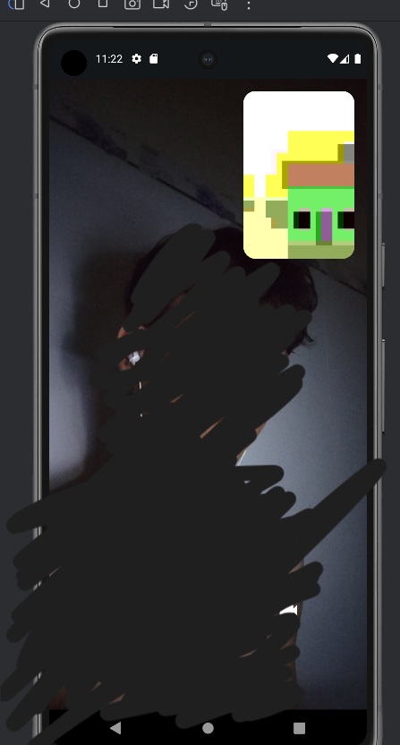

**WHORU**

Hello, this is a first version, it will be updated in the future.

**FEATURE**  
Login/Register  
Verify code  
Create Feed  
Like/Comment/Share  
View list Like/Comment/Share  
Search Users  
User Location  
User Profile  
Update Avatar/Background/Info user  
Realtime chat  
Video/Voice call  

# **DEMO**

### Setup  
Dart SDK version: 3.0.5  
Flutter version: 3.10.5

**INSTALL**

git clone https://github.com/Lucisokiu/whoru_redesign.git

Open Android Studio

In terminal -> flutter pub get

Run project

